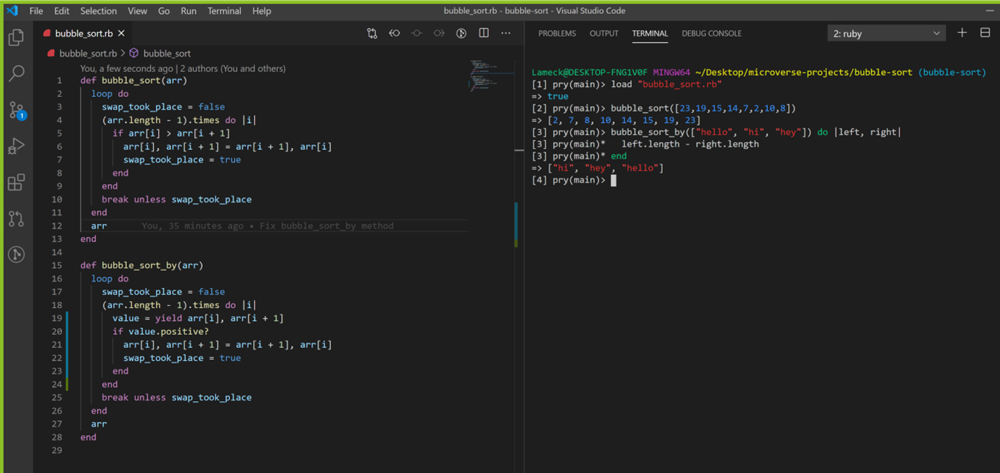

## Bubble Sort
This project involves building a method ```#bubble_sort``` that takes an array and returns a sorted array.



## Getting Started

- Clone this repository https://github.com/Lameck1/bubble-sort
- Change directory to bubble-sort folder
- Open pry and run the following command

```
load "bubble_sort.rb"
```

- Call methods in side ```bubble_sort.rb``` file, with an array as a parameter

    - For example

    ```
    bubble_sort([9,8,2,5,6,4,3,1,7])

    => [1,2,3,4,5,6,7,8,9]


    bubble_sort_by(["hi", "hello", "hey"]) do |left, right|
        left.length - right.length
        end

    => ["hi", "hey", "hello"]
    ```

## Live Demo

[Live Demo Link](https://repl.it/@lameck/bubblesort)

## Built with

- Ruby

## Authors

👤 **Lameck Otieno**
- GitHub: [@githubhandle](https://github.com/Lameck1)
- Twitter: [@twitterhandle](https://twitter.com/lameck721)
- LinkedIn: [LinkedIn](https://www.linkedin.com/in/lameck-odhiambo-642b7077/)

👤 **Igors Oleinikovs**
- GitHub: [@githubhandle](https://github.com/Igors78)
- Twitter: [@twitterhandle](https://twitter.com/oleinikovs)
- LinkedIn: [LinkedIn](https://www.linkedin.com/in/igors-oleinikovs-17a10958/)


## 🤝 Contributing

Contributions, issues, and feature requests are welcome!

## Show your support

Give a ⭐️ if you like this project!

## Acknowledgments

- Ruby docmentation
- [Ruby Guides](https://www.rubyguides.com/)

## 📝 License

This project is [MIT](./LICENSE) licensed.
